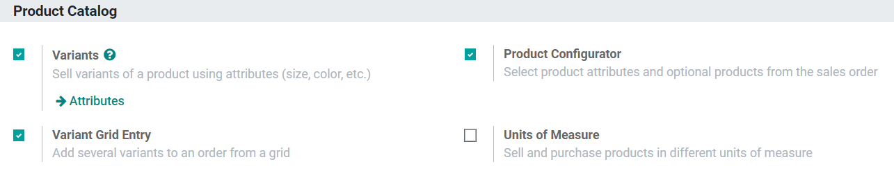
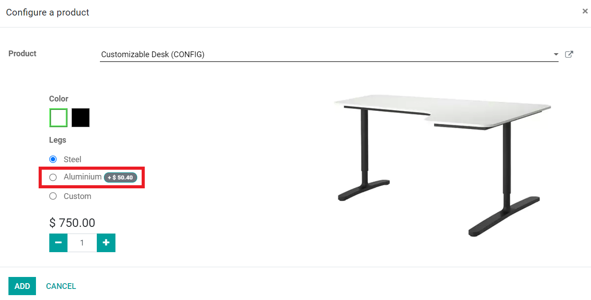
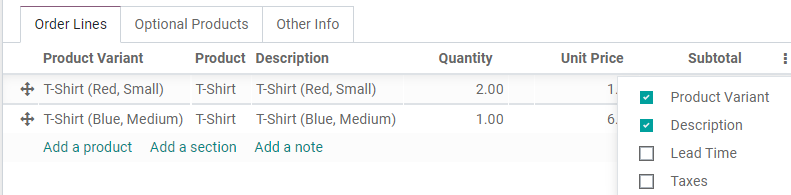
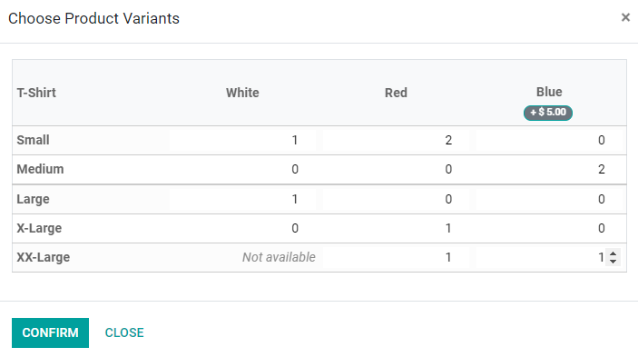
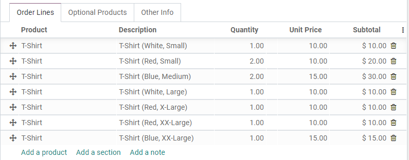

=========================================
Product Variants on quotations and orders
=========================================

Adding Product Variants to Quotations and Sales Orders can utilize the Product Configurator,
Variant Grid, or both depending on what is better the situation.

.. tip::
   Only one type of Variant Selection option can be active on a product template at a time. They
   can be edited at any time.

Activating the settings
=======================

Before using product variants on your quotations and sales orders, you first need to activate one
or both of the settings. To do so in the Sales App, head to menu :menuselection:`Configuration
--> Settings`, and locate the **Product Configurator** and **Variant Grid Entry** lines
respectively.

Using the Product Configurator
==============================
When activated, The Product Configurator appears on a Quotation or Sales Order when products are
added that have both Variants configured and the Product Configurator option selected.

Create a quotation and add a product with the Configurator enabled. Immediately, the Product
Configurator pops up on screen, and your Salespeople can choose from available options similar to
what you’d see when online shopping. Color options display any HTML color codes set-up in the
color attribute. Attributes with a price extra added will display the extra amount next to their
name.

After confirming a selection, the name of the product will be followed by the chosen variants in
parentheses as part of the Product Description, but they can also be shown if Product Variants
are checked in the additional options menu (3 dots).

Using Variant Grid Entries
==========================

Variant Grid Entries appear on a Quotation or Sales Order after adding products configured with
both Variants and **Order Grid Entry**. Grid Entry can streamline the process of entering large,
varied orders of a product through the ability to enter the exact quantities of every variation
all at once.

Create a quotation and add a product with the Grid Entry enabled. The Grid pops up on screen, and
salespeople can select as many available variants and quantities as they want by either typing in
the number or using the arrows. Any unavailable combinations display “Not Available” and cannot
have any quantities added.

Confirming your selections adds each variation as individual line items to the Quotation or Sales
Order. If, for example, the customer wants a small shirt in every available color, each shirt
will each have its own line item with individualized descriptions because each of these items
have their own stock.

